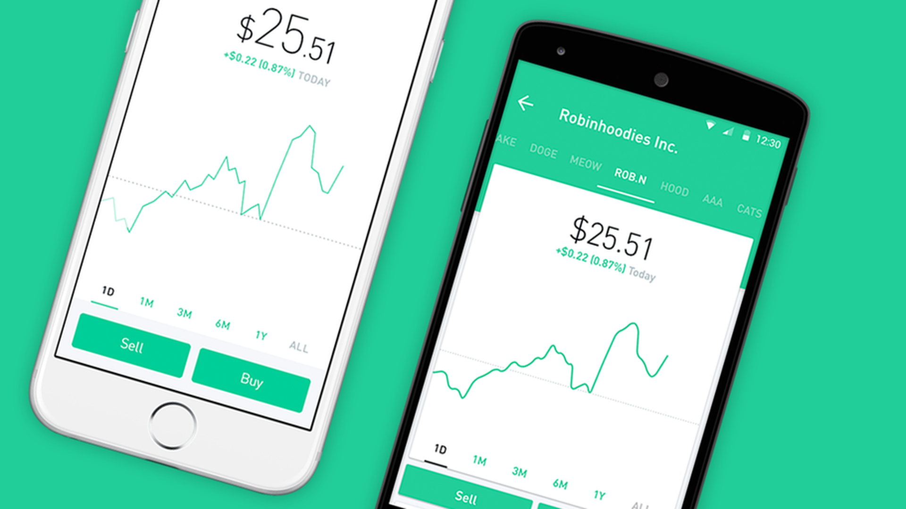

# RobinHood Casestudy

## Summary
Robinhood is an internet trading platform and broker that offers access to securities and derivatives markets.

## Contributors:
Hany Emara and Illya Nayshevsky, Ph.D.

### What is the background of your company? What do they do? Who are their competitors?

Robinhood Markets, Inc. is a trading platform and securities broker known for offering commission-free trades of stocks and exchange-traded funds via a mobile app. Robinhood is based in Menlo Park, CA, and was founded by [Vladimir Tenev](https://en.wikipedia.org/wiki/Vladimir_Tenev), and [Baiju Bhatt](https://en.wikipedia.org/wiki/Baiju_Bhatt). Robinbood is popular among younger invetors due to its ease of use and attractive GUI. 

According to [Bezinga](https://www.benzinga.com/money/robinhood-alternatives/) Robinhood's competitors are [WeBull](https://www.benzinga.com/go/webull-how-to-buy?pl=product-card), [TradeStation](https://www.benzinga.com/go/tradestation?pl=product-card-image) and [TDAmeritrade](https://www.benzinga.com/go/td-ameritrade-platform?pl=product-card-image).

### How does this company use technology to their advantage? Why are they considered a FinTech company?

### Why is this company exemplary in the FinTech space? What are their strengths and weaknesses?

RobinHood trading platform via an easy-to-use mobile app, in contrast to the PC focus of most of the more established players

easy tarding access and targetting Millennials for new investors. 

### What is the prognosis for this company? Where do they expect to be in the future?

Regulations are thier beggiest challange.

Market share has been increasing significanttly inthe past few year.

It will be one of the large player in the futur simillar to Amazon. 